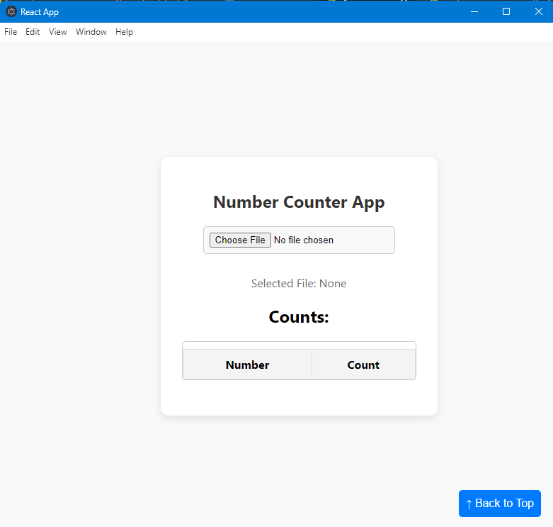
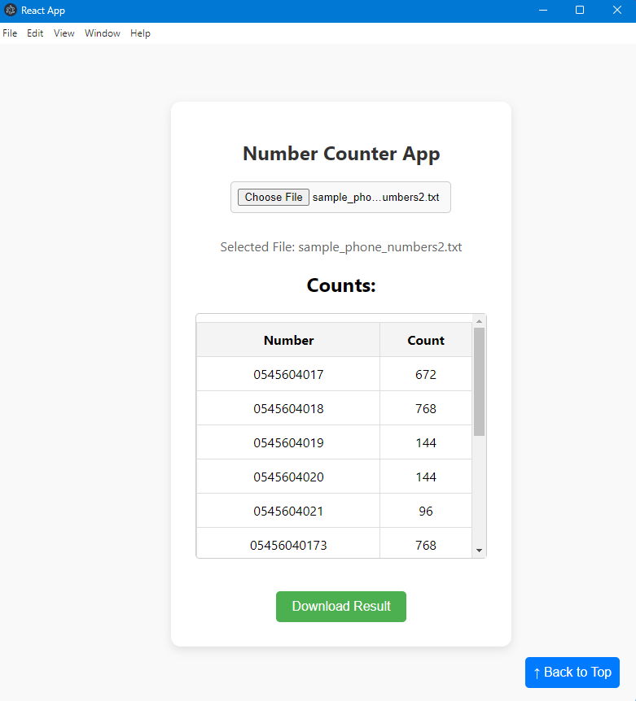

# Number Counter Desktop App

A simple React-based desktop application for counting the occurrences of numbers from a text file. The app allows users to upload a text file and provides a count of how many times each number appears in the file.

---

## 🚀 Features:
- **📂 File Upload**: Upload a text file containing numbers.
- **⚡ Real-time Count**: Processes the file and displays a count of each number's occurrences.
- **📊 Scrollable Table**: Displays the results in a scrollable table, ensuring a clean and organized view even for large datasets.
- **💻 Responsive Layout**: Adjusts for different screen sizes.
- **🔌 Electron Integration**: Packed as a desktop application using Electron.

---

## 🛠️ Installation

1. **Clone the repository:**
    ```bash
    git clone https://github.com/fuad-nasseraldeen/number-counter-desktop-app.git
    ```

2. **Install the dependencies:**
    ```bash
    npm install
    ```

3. **Run the application:**
    ```bash
    npm start
    ```
4. **Run the Desktop application:**
    ```bash
    npm run start-electron
    ```
5. **Build the Desktop application and Make an .exe file:**
    ```bash
    npm run package
    ```
---

## 📷 Screenshots



---

## ⚙️ Technologies Used

- **React** for UI development
- **Electron** for desktop application packaging
- **CSS** for styling and layout
- **Node.js** for file processing

---

## 📝 License

This project is licensed under the MIT License. Feel free to use, modify, and distribute this project.

---

## 🤝 Contributing

Contributions are welcome! Feel free to submit a pull request or open an issue to suggest changes or report bugs.

---

### 📫 Contact

If you have any questions, feel free to reach out at [fuad-nasseraldeen@gmail.com](mailto:fuad-nasseraldeen@gmail.com).

